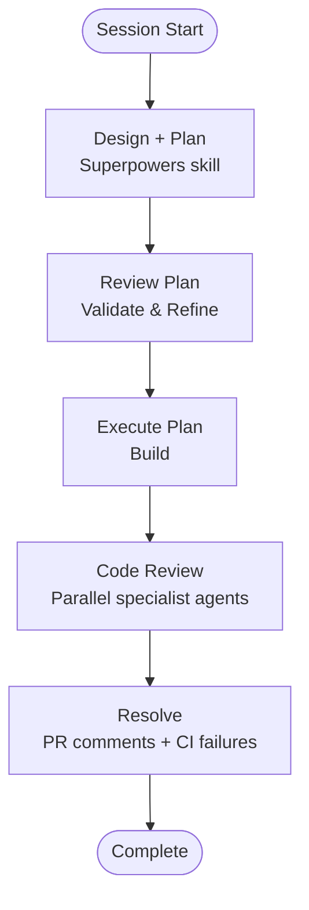

# Claude Code Toolkit

A collection of resources, workflows, and plugins for getting the most out of Claude Code.

## Overview

Claude Code is Anthropic's CLI for AI-assisted software engineering. This repository provides:

- **Plugins** — agents, commands, and skills that extend Claude Code's capabilities
- **Workflow patterns** — opinionated development loops that work well with Claude
- **Curated external resources** — third-party plugins worth knowing about

## Installation

Add this marketplace:

```
/plugin marketplace add dimagi/dimagi-claude-workflows
```

Then browse and install:

```
/plugins
```

## Plugins in This Repo

Each plugin's README documents its commands and skills.

| Plugin | What it does |
|--------|-------------|
| [code-review](plugins/code-review/) | Parallel specialist agents produce a prioritised code review, or pair-review a PR commit by commit |
| [dev-utils](plugins/dev_utils/) | Skills and commands for PRs, CI, plan review, git history, and dependency audits |
| [commcare-tech](plugins/commcare-tech/) | CommCare Tech Division — SAAS Jira workflows, sprint rituals, writing conventions |
| [connect-tech](plugins/connect-tech/) | CommCare Connect — Jira tickets and specs, release notes, docs audits |
| [uss-tech](plugins/uss-tech/) | USS Tech — Jira project management and USS-aware code review |
| [manager](plugins/manager/) | Standup, shutdown, 1:1 prep, and professional goal tracking |

## External Plugins

Included in this repo's [marketplace.json](.claude-plugin/marketplace.json) and installed alongside the local plugins.

| Plugin | What it does |
|--------|-------------|
| [Superpowers](https://github.com/obra/superpowers) | Plan → Build → Review workflow |
| [Context7](https://github.com/upstash/context7) | Up-to-date library documentation for LLMs |
| [Humanizer](https://github.com/trailofbits/skills-curated/tree/main/plugins/humanizer) | Remove AI writing patterns from text |
| [Visual Explainer](https://github.com/nicobailon/visual-explainer) | Documentation and visualization |
| [Dogfood](https://skills.sh/vercel-labs/agent-browser/dogfood) | Systematic web app exploration and bug finding |

### Other Recommended Plugins

- [Official Anthropic Claude Plugins](https://github.com/anthropics/claude-plugins-official) — git commit skills and more

## Development Workflow

A proven loop for Claude-assisted development:



## License

See [LICENSE](LICENSE) for details.
